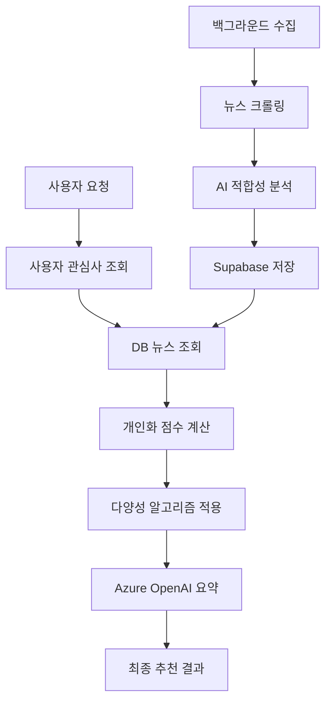

# 🤖 AI 뉴스 추천 알고리즘 상세 가이드

AI Finance News Recommendation System의 핵심 추천 알고리즘에 대한 기술적 상세 설명

## 📊 전체 추천 시스템 구조



## 🔄 1. 백그라운드 뉴스 수집 및 AI 분석

### 1.1 인기 종목 추출
```sql
-- 모든 사용자 관심사에서 상위 15개 종목 선택
SELECT interest, COUNT(*) as count 
FROM user_interests 
GROUP BY interest 
ORDER BY count DESC 
LIMIT 15;
```

### 1.2 뉴스 크롤링 소스
- **News API**: 글로벌 금융 뉴스
- **Yahoo Finance**: 종목별 전문 뉴스  
- **Naver**: 한국 종목 뉴스 (KS, KQ 종목)

### 1.3 AI 적합성 점수 계산

**기본 적합성 점수 (Base Score)**
```python
def calculate_base_relevance_score(article, symbol):
    score = 0.0
    title = article['title'].lower()
    description = article['description'].lower()
    
    # 1. 종목 심볼 직접 매치 (30%)
    if symbol.lower() in title:
        score += 0.25
    elif symbol.lower() in description:
        score += 0.15
    
    # 2. 회사명 매치 (회사별 키워드 매핑)
    company_keywords = get_company_keywords(symbol)
    for keyword in company_keywords:
        if keyword in title:
            score += 0.15
            break
        elif keyword in description:
            score += 0.1
            break
    
    # 3. 뉴스 신선도 (25%)
    freshness = calculate_freshness_score(article['published_at'])
    score += freshness * 0.25
    
    # 4. 소스 신뢰도 (20%)
    source_credibility = calculate_source_score(article['source'])
    score += source_credibility * 0.2
    
    # 5. 금융 키워드 밀도 (25%)
    finance_keywords = ['stock', 'shares', 'earnings', 'revenue']
    finance_score = calculate_keyword_density(title + description, finance_keywords)
    score += min(0.25, finance_score)
    
    return min(1.0, max(0.0, score))
```

**AI 적합성 점수 (AI Score)**
```python
# Azure OpenAI를 통한 뉴스 관련성 분석
async def analyze_news_relevance(article, symbols, context):
    prompt = f"""
    뉴스 제목: {article['title']}
    내용: {article['description']}
    관련 종목: {symbols}
    
    이 뉴스가 해당 종목들과 얼마나 관련이 있는지 0.0~1.0 점수로 평가해주세요.
    """
    
    response = await azure_openai.chat.completions.create(
        model=deployment_name,
        messages=[{"role": "user", "content": prompt}],
        temperature=0.3
    )
    
    return parse_relevance_score(response.choices[0].message.content)
```

**최종 적합성 점수**
```python
final_relevance_score = (base_score * 0.6) + (ai_score * 0.4)
```

## 🎯 2. 사용자별 개인화 추천 알고리즘

### 2.1 개인화 점수 계산 공식

```python
def calculate_personalization_score(article, user_interests, target_symbol):
    # 기존 적합성 점수 (DB에서 가져옴)
    base_relevance = article['relevance_score']  # 0~1
    
    # 종목 특화 점수 (해당 종목과의 직접적 관련성)
    symbol_specific_score = calculate_symbol_specific_score(article, target_symbol)
    
    # 사용자 관심도 (관심사 우선순위)
    user_interest_priority = get_interest_priority(target_symbol, user_interests)
    
    # 신선도 보너스
    freshness_bonus = calculate_freshness_bonus(article['published_at'])
    
    # 최종 개인화 점수 계산
    personalization_score = (
        base_relevance * 0.4 +           # 기본 적합성 40%
        symbol_specific_score * 0.3 +    # 종목 특화 30%  
        user_interest_priority * 0.2 +   # 사용자 관심도 20%
        freshness_bonus * 0.1            # 신선도 10%
    )
    
    return personalization_score
```

### 2.2 사용자 관심사 우선순위

```python
def get_interest_priority(symbol, user_interests):
    """사용자 관심사 목록에서의 우선순위"""
    try:
        index = user_interests.index(symbol)
        # 첫 번째: 1.0, 두 번째: 0.9, 세 번째: 0.8...
        return max(0.5, 1.0 - (index * 0.1))
    except ValueError:
        return 0.7  # 관심사가 아닌 경우 기본값
```

## 🌈 3. 다양성 알고리즘 (Diversity Algorithm)

### 3.1 다양성 보장 전략

**목적**: 특정 종목(예: NVDA)이나 소스가 추천을 독점하지 않도록 균형 유지

```python
def apply_diversity_algorithm(scored_articles, user_interests):
    # 1. 관심사별로 뉴스 그룹핑
    interest_groups = group_by_interest(scored_articles)
    
    # 2. 각 관심사별 최대 개수 제한
    max_per_interest = max(2, len(scored_articles) // len(user_interests))
    
    # 3. 라운드 로빈 방식으로 순차 선택
    diversified_articles = []
    used_sources = set()
    used_time_slots = set()
    used_categories = set()
    
    for round_num in range(max_per_interest):
        for interest in user_interests:
            if interest in interest_groups:
                article = interest_groups[interest][round_num]
                
                # 다양성 보너스 계산 및 적용
                diversity_bonus = calculate_diversity_bonus(
                    article, used_sources, used_time_slots, used_categories
                )
                
                # 최종 점수 = 기본 점수(85%) + 다양성 보너스(15%)
                final_score = (
                    article['personalization_score'] * 0.85 + 
                    diversity_bonus * 0.15
                )
                
                article['final_score'] = final_score
                diversified_articles.append(article)
                
                # 사용된 요소들 기록
                used_sources.add(article['source'])
                used_time_slots.add(get_time_slot(article['published_at']))
                used_categories.add(get_article_category(article))
    
    return sorted(diversified_articles, key=lambda x: x['final_score'], reverse=True)
```

### 3.2 다양성 보너스 계산

```python
def calculate_diversity_bonus(article, used_sources, used_time_slots, used_categories):
    bonus = 0.0
    
    # 1. 소스 다양성 (40%)
    source = article['source']
    if source not in used_sources:
        bonus += 0.4
    else:
        bonus += 0.1  # 이미 사용된 소스는 낮은 보너스
    
    # 2. 시간대 다양성 (30%)
    time_slot = get_time_slot(article['published_at'])  # dawn/morning/afternoon/evening
    if time_slot not in used_time_slots:
        bonus += 0.3
    else:
        bonus += 0.05
    
    # 3. 카테고리 다양성 (30%)
    category = get_article_category(article)  # earnings/analysis/market/product/etc
    if category not in used_categories:
        bonus += 0.3
    else:
        bonus += 0.05
    
    return min(1.0, bonus)
```

### 3.3 뉴스 카테고리 분류

```python
def get_article_category(article):
    """뉴스 카테고리 자동 분류"""
    text = (article['title'] + ' ' + article['description']).lower()
    
    categories = {
        'earnings': ['earnings', 'revenue', 'profit', '실적', 'quarterly'],
        'analysis': ['analyst', 'rating', 'upgrade', 'downgrade', '분석', '전망'],
        'market': ['market', 'trading', 'index', '시장', '거래'],
        'product': ['product', 'launch', 'innovation', '신제품', '출시'], 
        'corporate': ['merger', 'acquisition', 'deal', '인수', '합병'],
        'regulatory': ['regulation', 'policy', '규제', '정책', 'government']
    }
    
    for category, keywords in categories.items():
        if any(keyword in text for keyword in keywords):
            return category
    
    return 'general'
```

## 🤖 4. Azure OpenAI 기반 AI 요약 생성

### 4.1 개인화 요약 생성

```python
async def generate_personalized_summary(articles, user_interests):
    """사용자 관심사 기반 개인화 요약 생성"""
    
    # 뉴스 컨텍스트 구성
    news_context = "\n".join([
        f"{i+1}. {article['title']} - {article['description'][:100]}..."
        for i, article in enumerate(articles[:5])
    ])
    
    prompt = f"""
    다음은 사용자가 관심있어 하는 종목들({', '.join(user_interests)})과 관련된 최신 뉴스입니다.

    뉴스 목록:
    {news_context}

    위 뉴스들을 바탕으로 사용자를 위한 개인화된 분석을 JSON 형식으로 작성해주세요:

    {{
        "summary": "전체 상황을 2-3문장으로 요약",
        "highlights": ["주요 이슈 1", "주요 이슈 2", "주요 이슈 3"],
        "market_outlook": "긍정적|중립적|부정적",
        "actionable_insights": ["실용적인 투자 조언 1", "실용적인 투자 조언 2"]
    }}
    """
    
    response = await azure_openai.chat.completions.create(
        model=deployment_name,
        messages=[
            {"role": "system", "content": "당신은 금융 분석 전문가입니다."},
            {"role": "user", "content": prompt}
        ],
        temperature=0.3
    )
    
    return parse_json_response(response.choices[0].message.content)
```

### 4.2 종목별 전문 분석

```python
async def generate_stock_specific_summary(articles, symbol):
    """특정 종목에 대한 전문적 AI 분석"""
    
    company_info = get_company_info(symbol)  # 회사 정보 매핑
    
    prompt = f"""
    다음은 {company_info['name']} ({symbol}) 관련 최신 뉴스입니다.

    회사 정보:
    - 회사명: {company_info['name']}
    - 섹터: {company_info['sector']} 
    - 설명: {company_info['description']}

    뉴스 분석을 바탕으로 전문적인 투자 분석을 제공해주세요:

    {{
        "summary": "현재 상황 요약",
        "highlights": ["주요 이슈들"],
        "market_outlook": "긍정적|중립적|부정적",
        "stock_impact": "상승|보합|하락",
        "actionable_insights": ["투자자를 위한 실용적 조언"],
        "risk_factors": ["주의해야 할 리스크 요소"],
        "key_metrics": ["주목해야 할 지표나 이벤트"]
    }}
    """
    
    return await process_ai_analysis(prompt)
```

## 🚀 5. 성능 최적화 전략

### 5.1 캐싱 및 사전 처리
- **백그라운드 수집**: 인기 종목 뉴스를 미리 수집하고 AI 분석 완료
- **DB 저장**: 적합성 점수를 사전 계산하여 Supabase에 저장
- **빠른 응답**: 사용자 요청 시 DB에서 즉시 조회 (4-5초 응답)

### 5.2 병렬 처리
```python
# 종목별 뉴스 수집 병렬 처리
collection_tasks = []
for symbol in popular_symbols:
    task = collect_and_analyze_symbol_news(symbol, limit_per_symbol)
    collection_tasks.append(task)

results = await asyncio.gather(*collection_tasks, return_exceptions=True)
```

### 5.3 폴백 메커니즘
- **AI 분석 실패**: 기본 점수 계산으로 폴백
- **API 타임아웃**: 캐시된 결과 반환
- **네트워크 오류**: 로컬 계산 결과 활용

## 📊 6. 추천 품질 지표

### 6.1 정확도 측정
- **관련성 점수**: 사용자 관심사와의 일치도
- **다양성 지수**: 소스/카테고리/시간대 분포 균형
- **신선도 지표**: 최신 뉴스 비율

### 6.2 사용자 만족도
- **클릭율 (CTR)**: 추천 뉴스 클릭 비율
- **체류 시간**: 뉴스 읽기 시간
- **재방문율**: 시스템 재사용 빈도

## 🔄 7. 알고리즘 업데이트 및 학습

### 7.1 피드백 루프
```python
def update_recommendation_weights(user_feedback):
    """사용자 피드백을 통한 가중치 조정"""
    if user_feedback['action'] == 'click':
        increase_weight(user_feedback['article_category'])
    elif user_feedback['action'] == 'skip':
        decrease_weight(user_feedback['article_source'])
```

### 7.2 A/B 테스팅
- 다양한 점수 가중치 조합 테스트
- 다양성 알고리즘 파라미터 최적화
- AI 프롬프트 성능 비교

## 🎯 결론

본 AI 뉴스 추천 알고리즘은 다음과 같은 특징을 가집니다:

1. **🎯 높은 정확도**: 기본 점수(60%) + AI 분석(40%)로 정확한 관련성 판단
2. **🌈 균형잡힌 다양성**: 종목/소스/시간/카테고리 다양성 보장
3. **⚡ 빠른 성능**: 백그라운드 사전 처리로 4-5초 응답
4. **🤖 AI 강화**: Azure OpenAI 기반 고품질 요약 및 분석
5. **📈 지속 개선**: 사용자 피드백 기반 알고리즘 최적화

이러한 종합적 접근 방식을 통해 사용자에게 개인화되고 다양하며 고품질의 금융 뉴스 추천 서비스를 제공합니다.

---

🔬 **AI Finance News Recommendation Algorithm** v2.0.0