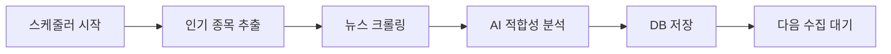
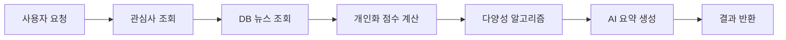

# 🤖 AI Finance News Recommendation System

AI 기반 금융 뉴스 추천 및 분석 시스템 - Microsoft Azure OpenAI와 Supabase를 활용한 개인화된 투자 정보 플랫폼

[](https://github.com/yourusername/MS_AI_FOUNDRY)
[](LICENSE)

## 📋 목차

- [프로젝트 개요](#-프로젝트-개요)
- [주요 기능](#-주요-기능)
- [기술 스택](#-기술-스택)
- [시스템 아키텍처](#-시스템-아키텍처)
- [설치 및 실행](#-설치-및-실행)
- [환경 변수 설정](#-환경-변수-설정)
- [API 문서](#-api-문서)
- [AI 추천 알고리즘](#-ai-추천-알고리즘)
- [데이터베이스 스키마](#-데이터베이스-스키마)
- [프로젝트 구조](#-프로젝트-구조)

## 🎯 프로젝트 개요

AI Finance News Recommendation System은 개인 투자자들에게 맞춤형 금융 뉴스와 종목 분석을 제공하는 AI 기반 플랫폼입니다. 사용자의 관심 종목을 학습하여 관련성 높은 뉴스를 자동으로 수집하고, OpenAI를 활용하여 심층 분석 및 요약을 제공합니다.

### 핵심 가치

- **개인화**: 사용자 관심사 기반 맞춤형 뉴스 추천
- **AI 분석**: OpenAI를 활용한 전문적인 투자 인사이트
- **실시간성**: 자동화된 뉴스 크롤링 및 실시간 업데이트
- **다양성**: 여러 소스에서 균형잡힌 정보 제공

## ✨ 주요 기능

### 1. 🎯 AI 기반 뉴스 추천
- 사용자 관심 종목 기반 개인화 추천
- 기본 점수(60%) + AI 분석(40%)을 결합한 정교한 관련성 평가
- 다양성 알고리즘으로 균형잡힌 뉴스 제공

### 2. 📊 종목 분석 및 차트
- 실시간 주가 데이터 조회 (Yahoo Finance API)
- 인터랙티브 차트 (Recharts)
- OpenAI 기반 종목 분석 및 투자 인사이트

### 3. 🤖 AI 요약 및 분석
- 뉴스 자동 요약
- 시장 전망 및 투자 조언
- 리스크 요인 분석

### 4. 📰 자동화된 뉴스 수집
- 백그라운드 스케줄러 (APScheduler) - 2시간마다 자동 실행
- 다중 소스 크롤링: News API, Yahoo Finance, Naver News
- 인기 종목 자동 추출 및 뉴스 수집

### 5. 👤 사용자 관리
- JWT 기반 인증 (Access Token + Refresh Token)
- Supabase Auth 통합
- 관심 종목 관리
- 검색 및 뉴스 열람 히스토리

### 6. 🌐 실시간 데이터
- 주가 정보 실시간 조회
- 관심 종목 모니터링
- 뉴스 알림 (예정)

## 🛠 기술 스택

### Backend
- **Framework**: FastAPI 0.104+
- **Database**: Supabase (PostgreSQL)
- **AI/ML**:
  - OpenAI(GPT-4.0 mini)
- **Authentication**: JWT (python-jose)
- **Web Scraping**:
  - BeautifulSoup4
  - aiohttp
  - httpx
- **Task Scheduling**: APScheduler
- **Financial Data**:
  - yfinance
  - News API
  - Naver API

### Frontend
- **Framework**: Next.js 16 (React 19)
- **Language**: TypeScript
- **Styling**: Tailwind CSS 4
- **UI Components**:
  - Radix UI
  - Material-UI (MUI)
  - shadcn/ui
- **State Management**: React Hooks
- **Charts**: Recharts
- **HTTP Client**: Axios
- **Authentication**: Supabase Client

### DevOps & Cloud
- **Cloud Platform**: Google Cloud Platform (Cloud Run)
- **Database**: Supabase Cloud
- **AI Service**: OpenAI API
- **Container**: Docker
- **CI/CD**: Google Cloud Build

## 🏗 시스템 아키텍처

```
┌─────────────────────────────────────────────────────────────┐
│                        Frontend (Next.js)                    │
│  ┌──────────┐  ┌──────────┐  ┌──────────┐  ┌──────────┐   │
│  │  Login   │  │Dashboard │  │  News    │  │  Chart   │   │
│  └──────────┘  └──────────┘  └──────────┘  └──────────┘   │
└───────────────────────────┬─────────────────────────────────┘
                            │ HTTP/REST API
┌───────────────────────────▼─────────────────────────────────┐
│                    Backend (FastAPI)                         │
│  ┌─────────────────────────────────────────────────────┐   │
│  │            API Router Layer                          │   │
│  │  /auth  /news  /analysis  /stocks  /recommendations │   │
│  └────────────────────┬────────────────────────────────┘   │
│  ┌────────────────────▼────────────────────────────────┐   │
│  │           Service Layer                              │   │
│  │  - News Collection Service                           │   │
│  │  - AI Recommendation Service                         │   │
│  │  - OpenAI Service                                    │   │
│  │  - Stock Service                                     │   │
│  └────────────────────┬────────────────────────────────┘   │
│  ┌────────────────────▼────────────────────────────────┐   │
│  │     Background Scheduler (APScheduler)               │   │
│  │  - News Crawling (Every 2 hours)                     │   │
│  │  - Popular Symbols Extraction                        │   │
│  └──────────────────────────────────────────────────────┘   │
└───────────────┬─────────────────┬────────────────────────────┘
                │                 │
    ┌───────────▼─────┐   ┌───────▼─────────┐
    │   Supabase DB   │   │    OpenAI       │
    │  - PostgreSQL   │   │    - GPT-4      │
    │  - Auth         │   │    - Analysis   │
    │  - RLS          │   │    - Summary    │
    └─────────────────┘   └─────────────────┘
            │
    ┌───────▼────────┐
    │ External APIs  │
    │ - News API     │
    │ - Yahoo Finance│
    │ - Naver News   │
    └────────────────┘
```

## 🚀 설치 및 실행

### 필수 요구사항

- Python 3.9+
- Node.js 18+
- Supabase 계정
- OpenAI API 키
- (선택) OpenAI API 키

### Backend 설치 및 실행

```bash
# 1. 프로젝트 클론
git clone https://github.com/yourusername/MS_AI_FOUNDRY.git
cd MS_AI_FOUNDRY

# 2. Backend 디렉토리로 이동
cd backend

# 3. 가상환경 생성 및 활성화
python -m venv venv
source venv/bin/activate  # Windows: venv\Scripts\activate

# 4. 의존성 설치
pip install -r requirements.txt

# 5. 환경 변수 설정
cp .env.example .env
# .env 파일 편집 (아래 환경 변수 설정 섹션 참조)

# 6. Supabase 데이터베이스 스키마 적용
# Supabase Dashboard에서 SQL Editor를 열고
# supabase_schema.sql 파일 내용 실행

# 7. 서버 실행
uvicorn app.main:app --reload --host 0.0.0.0 --port 8000
```

Backend 서버: `http://localhost:8000`
API 문서: `http://localhost:8000/docs`

### Frontend 설치 및 실행

```bash
# 1. Frontend 디렉토리로 이동
cd frontend

# 2. 의존성 설치
npm install

# 3. 환경 변수 설정
# .env.local 파일 생성 및 편집
echo "NEXT_PUBLIC_API_URL=http://localhost:8000" > .env.local
echo "NEXT_PUBLIC_SUPABASE_URL=your_supabase_url" >> .env.local
echo "NEXT_PUBLIC_SUPABASE_ANON_KEY=your_supabase_anon_key" >> .env.local

# 4. 개발 서버 실행
npm run dev
```

Frontend 서버: `http://localhost:3000`

### Docker 실행 (선택사항)

```bash
# Backend Docker 빌드 및 실행
cd backend
docker build -t ai-finance-backend .
docker run -p 8000:8000 --env-file .env ai-finance-backend
```

## 🔐 환경 변수 설정

### Backend (.env)

```bash
# Supabase
SUPABASE_URL=https://your-project.supabase.co
SUPABASE_KEY=your-supabase-anon-key

# JWT
SECRET_KEY=your-secret-key-min-32-characters
ALGORITHM=HS256

# Azure OpenAI (권장)
AZURE_OPENAI_ENDPOINT=https://your-resource.openai.azure.com/
AZURE_OPENAI_KEY=your-azure-openai-key
AZURE_OPENAI_VERSION=2023-12-01-preview
AZURE_OPENAI_DEPLOYMENT=your-deployment-name

# OpenAI (대체 옵션)
OPENAI_API_KEY=sk-your-openai-api-key

# News APIs
NEWS_API_KEY=your-newsapi-key
NAVER_CLIENT_ID=your-naver-client-id
NAVER_CLIENT_SECRET=your-naver-client-secret

# Legacy Database (선택사항)
DATABASE_URL=sqlite:///./finance_ai.db
```

### Frontend (.env.local)

```bash
NEXT_PUBLIC_API_URL=http://localhost:8000
NEXT_PUBLIC_SUPABASE_URL=https://your-project.supabase.co
NEXT_PUBLIC_SUPABASE_ANON_KEY=your-supabase-anon-key
```

## 📚 API 문서

### Authentication (v2)

#### 회원가입
```http
POST /api/v2/auth/register
Content-Type: application/json

{
  "username": "user123",
  "email": "user@example.com",
  "password": "securepassword"
}
```

#### 로그인
```http
POST /api/v2/auth/login
Content-Type: application/x-www-form-urlencoded

username=user123&password=securepassword
```

응답:
```json
{
  "access_token": "eyJ...",
  "refresh_token": "eyJ...",
  "token_type": "bearer"
}
```

#### Refresh Token
```http
POST /api/v2/auth/refresh
Authorization: Bearer {refresh_token}
```

### News APIs (v2)

#### 추천 뉴스 조회
```http
GET /api/v2/recommendations/news/recommended?limit=10
Authorization: Bearer {access_token}
```

응답:
```json
{
  "recommendations": [
    {
      "id": 1,
      "title": "NVIDIA Announces New AI Chip",
      "description": "NVIDIA unveiled...",
      "url": "https://...",
      "source": "Reuters",
      "published_at": "2025-01-15T10:30:00Z",
      "relevance_score": 0.92,
      "ai_summary": "..."
    }
  ],
  "total": 20,
  "ai_summary": {
    "summary": "Overall market analysis...",
    "highlights": ["Key point 1", "Key point 2"],
    "market_outlook": "긍정적"
  }
}
```

#### 종목별 뉴스 조회
```http
GET /api/v2/news/stock/{symbol}?ai_mode=true&limit=5
Authorization: Bearer {access_token}
```

### Stock APIs (v1)

#### 주가 정보 조회
```http
GET /api/v1/stocks/{symbol}
```

#### 주가 차트 데이터
```http
GET /api/v1/stocks/{symbol}/chart?period=1mo&interval=1d
```

### Analysis APIs (v2)

#### AI 종목 분석
```http
POST /api/v2/analysis/{symbol}
Authorization: Bearer {access_token}
```

전체 API 문서: `http://localhost:8000/docs` (Swagger UI)

## 🧠 AI 추천 알고리즘

본 시스템은 다층 AI 추천 알고리즘을 사용합니다:

### 1. 백그라운드 뉴스 수집 및 AI 분석

**인기 종목 추출**
```sql
SELECT interest, COUNT(*) as count
FROM user_interests
GROUP BY interest
ORDER BY count DESC
LIMIT 15;
```

**AI 적합성 점수 계산**
- 기본 적합성 점수 (60%): 종목 매칭, 신선도, 소스 신뢰도, 금융 키워드 밀도
- AI 분석 점수 (40%): Azure OpenAI를 통한 관련성 분석

### 2. 개인화 추천

**개인화 점수 공식**
```python
personalization_score = (
    base_relevance * 0.4 +           # 기본 적합성 40%
    symbol_specific_score * 0.3 +    # 종목 특화 30%
    user_interest_priority * 0.2 +   # 사용자 관심도 20%
    freshness_bonus * 0.1            # 신선도 10%
)
```

### 3. 다양성 알고리즘

특정 종목이나 소스가 추천을 독점하지 않도록 균형 유지:

- 소스 다양성 (40%)
- 시간대 다양성 (30%)
- 카테고리 다양성 (30%)

**최종 점수**
```python
final_score = (
    personalization_score * 0.85 +
    diversity_bonus * 0.15
)
```

자세한 알고리즘 설명: [NEWS_RECOMMENDATION_ALGORITHM.md](NEWS_RECOMMENDATION_ALGORITHM.md)

## 🗄 데이터베이스 스키마

### 주요 테이블

#### auth_users
```sql
- id (VARCHAR, PK)
- username (VARCHAR, UNIQUE)
- email (VARCHAR, UNIQUE)
- hashed_password (VARCHAR)
```

#### user_interests
```sql
- id (SERIAL, PK)
- user_id (VARCHAR, FK)
- interest (VARCHAR)
```

#### news_articles
```sql
- id (SERIAL, PK)
- symbol (VARCHAR)
- title (VARCHAR)
- description (TEXT)
- content (TEXT)
- url (VARCHAR, UNIQUE)
- source (VARCHAR)
- published_at (TIMESTAMP)
- relevance_score (FLOAT)
- base_score (FLOAT)
- ai_score (FLOAT)
- analyzed_at (TIMESTAMP)
```

#### ai_analysis_history
```sql
- id (SERIAL, PK)
- user_id (VARCHAR, FK)
- symbol (VARCHAR)
- analysis_type (VARCHAR)
- analysis_content (TEXT)
- additional_data (JSONB)
- created_at (TIMESTAMP)
```

#### refresh_tokens
```sql
- id (SERIAL, PK)
- user_id (VARCHAR, FK)
- token_hash (VARCHAR, UNIQUE)
- expires_at (TIMESTAMP)
- is_revoked (BOOLEAN)
```

전체 스키마: [backend/supabase_schema.sql](backend/supabase_schema.sql)

## 📁 프로젝트 구조

```
MS_AI_FOUNDRY/
├── backend/
│   ├── app/
│   │   ├── api/
│   │   │   ├── auth_supabase.py         # 인증 API
│   │   │   ├── news_supabase.py         # 뉴스 API
│   │   │   ├── recommendations_supabase.py  # 추천 API
│   │   │   ├── analysis_supabase.py     # 분석 API
│   │   │   └── stocks.py                # 주식 데이터 API
│   │   ├── core/
│   │   │   ├── config.py                # 설정
│   │   │   ├── security.py              # JWT/암호화
│   │   │   └── auth_supabase.py         # 인증 의존성
│   │   ├── services/
│   │   │   ├── ai_news_recommendation_service.py  # AI 추천
│   │   │   ├── azure_openai_service.py  # Azure OpenAI
│   │   │   ├── background_news_collector.py  # 뉴스 수집
│   │   │   ├── news_scheduler.py        # 스케줄러
│   │   │   ├── stock_service.py         # 주식 데이터
│   │   │   ├── refresh_token_service.py # Refresh Token
│   │   │   └── supabase_*.py           # Supabase 서비스들
│   │   ├── models/
│   │   │   ├── user.py
│   │   │   ├── news_article.py
│   │   │   └── ai_analysis_history.py
│   │   ├── db/
│   │   │   └── supabase_client.py
│   │   └── main.py                      # FastAPI 앱
│   ├── requirements.txt
│   ├── supabase_schema.sql              # DB 스키마
│   ├── Dockerfile
│   └── .env
├── frontend/
│   ├── app/
│   │   ├── page.tsx                     # 메인 페이지
│   │   └── globals.css
│   ├── components/
│   │   ├── LoginPage.tsx
│   │   ├── RegisterPage.tsx
│   │   ├── MainPage.tsx
│   │   ├── Dashboard.tsx
│   │   ├── NewsSection.tsx
│   │   ├── StockChart.tsx
│   │   └── StockAnalysis.tsx
│   ├── services/
│   │   ├── api.ts                       # API 클라이언트
│   │   └── authService.ts               # 인증 서비스
│   ├── lib/
│   │   └── supabase.ts                  # Supabase 클라이언트
│   ├── types/
│   │   └── api.ts                       # TypeScript 타입
│   ├── package.json
│   ├── next.config.js
│   ├── tailwind.config.ts
│   └── .env.local
├── NEWS_RECOMMENDATION_ALGORITHM.md      # 알고리즘 상세 문서
├── REFRESH_TOKEN_SETUP.md               # Refresh Token 가이드
└── README.md
```

## 🔄 주요 워크플로우

### 1. 뉴스 수집 프로세스



### 2. 뉴스 추천 프로세스



## 🔒 보안

- JWT 기반 인증 (Access Token + Refresh Token)
- Refresh Token 해시 저장
- Supabase Row Level Security (RLS)
- CORS 설정
- 비밀번호 해싱 (bcrypt)
- SQL Injection 방지 (ORM 사용)

## 🚢 배포

### Google Cloud Run 배포

```bash
# 1. 프로젝트 설정
gcloud config set project YOUR_PROJECT_ID

# 2. 빌드 및 배포
cd backend
gcloud builds submit --config cloudbuild.yaml

# 3. 환경 변수 설정
gcloud run services update ai-finance-backend \
  --set-env-vars SUPABASE_URL=...,SUPABASE_KEY=...,...
```

## 🧪 테스트

```bash
# Backend 테스트
cd backend
pytest

# Frontend 테스트
cd frontend
npm test
```

## 📝 향후 계획

- [ ] 실시간 뉴스 알림 (WebSocket)
- [ ] 모바일 앱 개발 (React Native)
- [ ] 포트폴리오 추적 기능
- [ ] 커뮤니티 기능 (댓글, 공유)
- [ ] 다국어 지원
- [ ] 고급 차트 분석 도구
- [ ] 백테스팅 기능

## 🤝 기여

기여를 환영합니다! Pull Request를 보내주세요.

1. Fork the Project
2. Create your Feature Branch (`git checkout -b feature/AmazingFeature`)
3. Commit your Changes (`git commit -m 'Add some AmazingFeature'`)
4. Push to the Branch (`git push origin feature/AmazingFeature`)
5. Open a Pull Request

## 📄 라이선스

This project is licensed under the MIT License - see the [LICENSE](LICENSE) file for details.

## 📧 문의

프로젝트 관련 문의: your-email@example.com

Project Link: [https://github.com/yourusername/MS_AI_FOUNDRY](https://github.com/yourusername/MS_AI_FOUNDRY)

## 🙏 감사의 글

- [FastAPI](https://fastapi.tiangolo.com/)
- [Next.js](https://nextjs.org/)
- [Supabase](https://supabase.com/)
- [Microsoft Azure OpenAI](https://azure.microsoft.com/en-us/products/ai-services/openai-service)
- [Tailwind CSS](https://tailwindcss.com/)
- [Radix UI](https://www.radix-ui.com/)

---

Made with ❤️ by AI Finance Team
